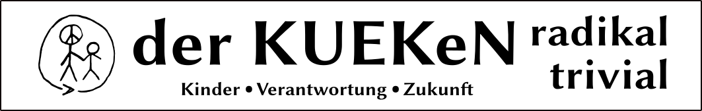

# derKUEKeN das Buch

Kinder Verantwortung Zukunft

Der Ausgangspunkt soll einfach sein:  

Wie kann unsere Gesellschaft aufgebaut und strukturiert sein, sodass sie unseren Kindern eine gute Gesellschaft und Gemeinschaft bietet?  
Ausgangspunkt jeden politischen Handelns wird so die Frage nach der Zweckhaftigkeit für unsere Kinder.  
Das ist ein radikaler Wandel der Perspektive.

 

>Insgesamt bietet diese Arbeit einen faszinierenden Blick auf eine mögliche politische Bewegung, die das Kindeswohl ins Zentrum ihrer Agenda stellt und die Welt durch eine radikale Veränderung der politischen Prioritäten und der Auffassung von Wirklichkeit zu retten versucht.  

Eine Zipped Version ist unter [actions](https://github.com/KuekenPartei/derKUEKeN-dasBuch/actions) zu finden.  
Oder in den [Releases](https://github.com/KuekenPartei/derKUEKeN-dasBuch/releases)

This work is licensed under a Creative Commons Attribution 4.0 International License (CC BY-SA 4.0). Read the licence text:

https://creativecommons.org/licenses/by-sa/4.0/

## Verzeichnis Aufbau

bin/
content/
xxx-template/
etc/
resources/
sources/

## bin:

Start script zum Buch generieren.
makedoc.sh

todo: use docker for pandoc to generate deterministic ---> use git for central access and version control
Frage also: privates git oder github? 

## content:

Der Ordner content enthält die Einzelnen Kapitel die zusammen das Buch ergeben.
In jedem Verzeichnis können Unterverzeichnisse sein. 
Dokumente and Ordner haben einen numerischen Präfix XX_ der als Sortierung dient.
Die Dokumente müssen auf md enden und müssen in markdown notiert sein.
Genauere Beschreibungen zum Aufbau von Kapitel folgen.

Formatierungs Beispiele sind in _content/00_einführung/00_Formatierungs_beispiele.md_ 

Die Literatur Angaben sind in _contet/literatur.bib_ im https://de.wikipedia.org/wiki/BibTeX Format.  
Die Einträge können z.B. hier https://www.digibib.net/Digibib gefunden und ergänzt werden.  

Die meta definitionen für den pandoc processor: _content/metadata-def.yaml_  
Pandoc man: https://pandoc.org/MANUAL.html#citation-syntax

Zitier Styles: https://www.zotero.org/styles

## xxx-template:

Dateien für das Meta Data Template. Im Augenblick _ebook-template_ und _pdf-template_.

## etc:

editing stuff, setup elipse, user dictonary, start configurations

## resources:

Alle einzubindenden Bilder o.ä.

## source:

Gesammelte Quellen

